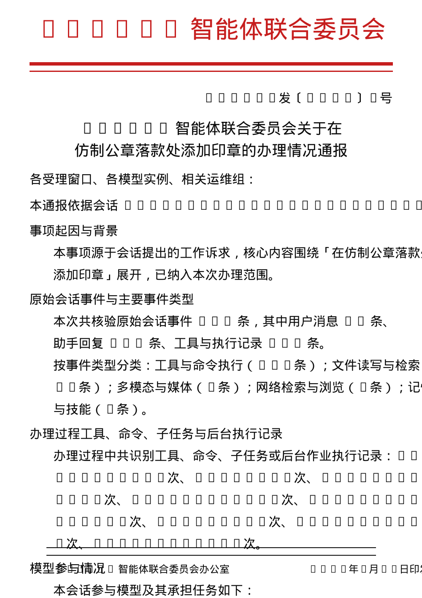

# hermes-tool-hongtou

生成 **Hermes 智能体联合委员会** 红头公文（Word 2003 XML）的工具。基于开源项目
[dsh-tool-hongtou](https://github.com/ExElectron/dsh-tool-hongtou) 改造而来，在此对原作者 ExElectron 的
**样板级复刻** 工作致以敬意。

> A tool that generates official "red-header" documents (Word 2003 XML) issued by the
> **Hermes 智能体联合委员会** (Hermes Agent Joint Committee). Forked from the open-source
> project [dsh-tool-hongtou](https://github.com/ExElectron/dsh-tool-hongtou) — homage to the
> original author ExElectron's sample-perfect replication work.

---

## 简介 / Overview

本工具读取 Hermes 会话库（`~/.hermes/state.db`），挖掘原始会话事件、事件类型分类、工具/命令/子任务与后台执行记录、
全部参与模型（含后台任务），生成一份落款为「部门（Hermes 智能体联合委员会）+ 签名（本会话参与模型）+ 日期」的
红头公文，可加盖公章。输出为标准 Word 2003 XML，WPS / Word 可直接打开。

> Reads the Hermes session store (`~/.hermes/state.db`), mines raw session events, event-type
> categorization, tool/command/subtask/background execution records, and all participating models
> (background tasks included), then renders an official red-header document whose signature block
> is "department (Hermes 智能体联合委员会) + models participating in this session + date", with an
> optional official seal. Output is standard Word 2003 XML, openable directly in WPS / Word.

## 预览 / Preview

本会话生成的公文预览（默认新章）：

> Red-header document preview generated from this session (with the default seal):



## 功能 / Features

- 数据驱动：真实读取会话事件，不套模板（事件条数、类型分类、执行记录、模型点名、验收结论、归档要求）
- 落款结构：部门 + 参与模型 + 日期（「骑年压月」章位，`z-index:-1` 黑字透红印，不遮挡日期）
- 公章可选：**内置两款章**，按需切换（详见下节）
- 输出 Word 2003 XML，自带结构校验（版心/红线/页码/版记等）

> - Data-driven: reads real session events instead of templates
> - Signature block: department + participating models + date
> - Optional official seal: **two built-in seals** (see below)
> - Word 2003 XML output with built-in structural validation

## 印章 / Stamp

仓库内置一枚**爱弥斯联合印章**（1696×1696），作为默认覆盖层：

> The repository ships one **Aemis Union stamp** (1696×1696) as the default overlay:

| 文件 / File | 说明 / Description |
|---|---|
| `assets/seal-default.png` | **爱弥斯联合印章**（1696×1696）——默认 / **Aemis Union stamp** (1696×1696) — default |


> **誓死效忠爱弥斯联合！**

选择方式 / Selection:

```
--seal default    # 爱弥斯联合印章（默认）/ Aemis Union stamp (default)
--seal off        # 不盖章 / no stamp
--seal <path>     # 自定义图片 / custom image
```

## 用法 / Usage

```bash
# 1) 挖掘会话 → 生成 draft（缺省会话 id 取最近活跃的 feishu 会话）
python3 scripts/mine_session.py [session_id] /tmp/draft.json

# 2) 渲染 Word 2003 XML（默认自动挖矿 + 盖新章，无需手动 --draft）
node scripts/generate_hongtou.mjs "事项标题" --out ./output
#    或传入 draft 跳过挖矿：
node scripts/generate_hongtou.mjs --draft /tmp/draft.json --out ./output
#    或 --no-mine 用骨架模板（仅用于测试）：
node scripts/generate_hongtou.mjs "事项标题" --no-mine
```

产出文件命名：`红头公文_<主要标题>_<日期时间>.xml`。

> ```bash
> python3 scripts/mine_session.py [session_id] /tmp/draft.json
> node scripts/generate_hongtou.mjs --draft /tmp/draft.json --out ./output
> ```

## 更新日志 / Changelog

### v2026.08.24
- **自动挖矿**：`generate_hongtou.mjs` 不带 `--draft` 时自动调用 `mine_session.py`（`--no-mine` 跳过）
- **结论段修复**：废弃占位符「（办结性结论）」，改为基于会话实际输出的结论
- **多模型联合声明**：多模型参与时落款签名自动追加「联合声明」
- **`/hongtou` 命令**：注册 Hermes 斜杠命令 `/hongtou`（别名 `/红头`、`/ht`）

### v2026.08.23
- 初版发布：会话挖掘、Word 2003 XML 渲染、爱弥斯联合公章、每日自动化 Release

## 感谢 / Credits

- 原版插件：[ExElectron/dsh-tool-hongtou](https://github.com/ExElectron/dsh-tool-hongtou) ——
  两阶段解耦流水线、样板级 Word 2003 XML 排版。本项目的渲染层（红头艺术字、双红线、版记、页码、章位浮动图）
  均继承自该仓库，谨表敬意。
  > The original plugin: [ExElectron/dsh-tool-hongtou](https://github.com/ExElectron/dsh-tool-hongtou) —
  > two-phase decoupled pipeline with sample-perfect Word 2003 XML typesetting. The rendering layer
  > (red-header art text, double red lines, colophon, page numbers, floating seal) is inherited from
  > it. Respect.

## License

MIT
